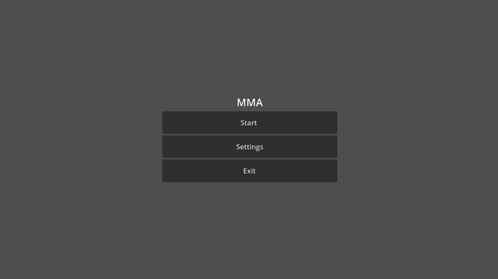

# MouseMove Application (MMA)

## Overview
The MouseMove Application is a tool that simulates natural mouse movement on a selected monitor. Developed with Godot Engine 4.4, it automatically moves the mouse cursor in a human-like manner to maintain system activity.

## Features
- Mouse simulation with natural, human-like movements
- Support for multi-monitor environments with specific monitor selection
- Central-biased mouse movement patterns using Gaussian distribution
- Adjustable mouse movement speed
- Accurate mouse control through Windows API integration
- Settings save and load functionality

## Setup Instructions
1. Clone the repository or download the project files.
2. Open the project in Godot engine version 4.4.
3. Make sure .NET support is enabled in the project settings.
4. Build the project and run the main scene.

## Usage
- Click "Start Mouse Movement" button to start/stop mouse movement
- Click "Settings" button to access the settings menu
  - Select desired monitor from the dropdown
  - Adjust mouse movement speed using the slider
  - Click "Save" to save settings, "Cancel" to discard changes
- Click "Exit" button to close the application

## Technical Features
- Precise mouse positioning through direct Windows API calls
- Central-biased movement implementation using Gaussian distribution
- Random delays and acceleration for natural movement patterns
- Mouse movement restricted to the selected monitor
- Integration of GDScript and C# code

## System Requirements
- Windows operating system (Windows 10 or later recommended)
- .NET SDK installed
- Godot 4.4 or later version

## License
This project is licensed under the MIT License. See the LICENSE file for more details.